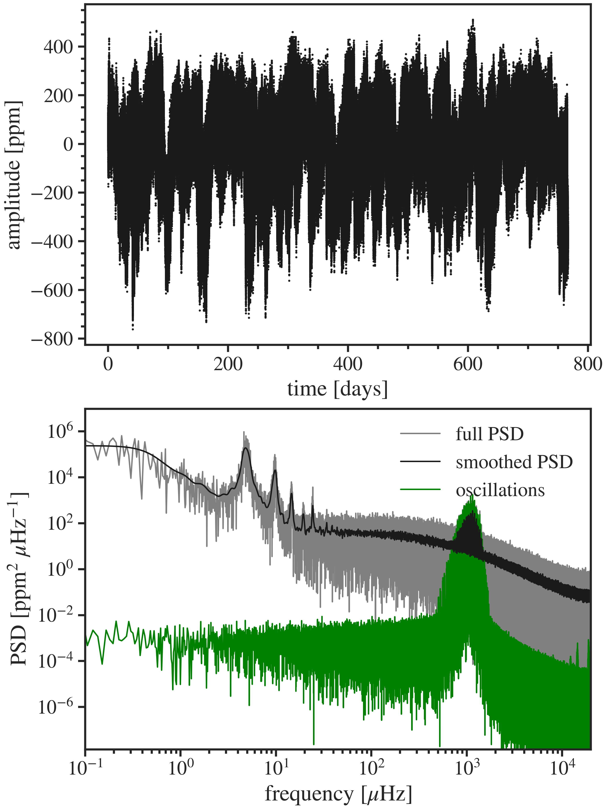

# Light curve simulator for pre-MS solar-like oscillators

**lightcurve_simulator.py** accepts the following:
- \texttt{MESA} models and \texttt{GYRE} frequencies.
- Length of time series in days.
- Cadence in days.

**lightcurve_simulator.py** then simulates the light curve components:
- Oscillation signal for degrees $\ell \leq 3$.
- Granulation signal (two Harvey components).
- Gaussian white-noise (either based on formalism of TESS ATL (Hey et al. 2024) or just a given value).
- Rotational modulation based on 'Butterpy' (https://github.com/zclaytor/butterpy)

**Calculate a full signal like so**
```python
# final_mass and acchist just calls a model folder, these can easily be adjusted for personal use 
full_signal(
        length=2.1*365, cadence=25/(60*60*24), 
        final_mass=1.4, 
        acchist=15, 
        profile_number=500, 
        ells=[0,1,2,3], 
        gran=True, noise=False, activity=True, do_plot=True, save_lc=True, delta_mag=False,
        dest_folder=f'./', ID=1
    )
```
## Example light curve and spectrum

